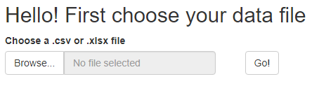
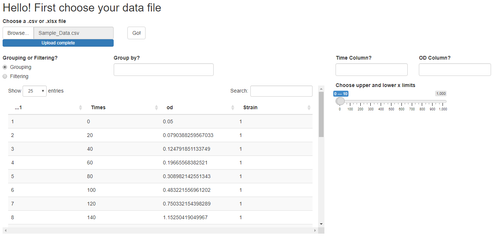
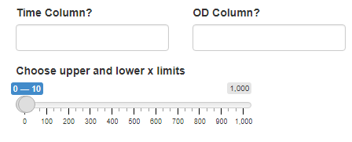
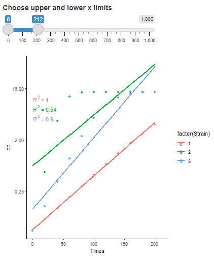

```{r setup, include = FALSE}
knitr::opts_chunk$set(
  collapse = TRUE,
  comment = "#>"
)
```

The doublr package allows you to load a shiny app through which you can interactively compute doubling times from growth curve data. 

## Installing the package

To install doublr, you'll need to make sure the package [devtools](https://www.r-project.org/nosvn/pandoc/devtools.html) is installed. Once you have installed devtools, doublr can be installed and loaded as follows:

```{r, eval=FALSE}
devtools::install_github("gus-pendleton/doublr")
library(doublr)
```

Note, doublr has a number of dependencies. The packages dplyr, ggplot2, and shiny are required to run; if your data is in an Excel sheet, the readxl package is also required. If you load the package as in the above example, these packages will be loaded automatically, however, if you call shiny app using the "doublr::" notation, it will fail unless these three packages have been loaded. 

## Using the shiny app

To launch the app, simply use the Launch() function:

```{r, eval = F}
Launch()
```

The resulting app will first prompt you to upload your data



Choose "Browse..." to pick your file. Once upload is complete, use "Go!" to begin analyzing your data. The result page should look something like this:

{width=100%}

This page can at first feel a little overwhelming, but let's work through each section individually. First, you should see your data displayed in the table below. Take a look and make sure your data has been loaded correctly. This table is reactive, so if you filter it its length should adjust. 

###Identifying the Time (independent) and OD (dependent) variables

The first thing you need to do is identify which columns represent your Time (or independent) variable, and which column(s) represent your dependent variable, whether that's OD, CFUs, Absorbance, etc. To do this, you'll type in the name of these columns under the "Time Column?" and "OD Column?" text input boxes:



Quotation marks ("") or apostrophes ('') are unnecessary, but these are still case sensitive. Column names that contain special characters should be avoided. Both columns *must be numerical*. At this time, consider whether your data is in a long format or wide format - if in long format, simply identify the column where numerical measures of OD are located. If in wide format, provide the column containing OD values for whichever strain/replicate is held in that column. This app does not work for data in which time points are used as column names - you'll need to pivot that data to a longer format separately. 

Once you identify the Time and OD columns, a graph should appear:



It likely won't look like much at first. You'll need to move the slider inputs to provide x-limits for your graph that fit your data. As you adjust the slider inputs, you'll see your linearized OD data being plotted. The y-axis has been log-transformed, and a linear model has been fit to whatever data is being included in the graph. The $$R^2$$ value provides a measure of linearity; you want to adjust your slider inputs to capture the maximum linear portion of your growth curve. These slider inputs will be used later for computing doubling times, and so they are important!

###Grouping or Filtering

If your dataset contains growth curve data solely from one replicate, these choices are unnecessary (and set to NULL), and you can continue to use the app as described below. However, for most biological experiments, you might have growth curve data from multiple strains, conditions, or replicates, for which you would like to quickly assess growth kinetics within each group. This is where the grouping and filtering options come in!

Let's start with grouping:


If the "Grouping or Filtering?" button is set to "Grouping", you'll have a text input labeled "Group by?" This is the column which you will use to group your data, separating it by strain/condition/replicate. Note that the app does not yet support grouping by multiple columns (though I'm hoping to develop that!). Again this text input does not require quotations, but is case sensitive and special characters should be avoided. Once you enter a valid column name, you won't see any difference in the table. However, you will see your graph has now reflected that change and provided linear fits within each group. Later, when you compute doubling times, doubling times will be computed within each group.

Alternatively, you can filter the data to only plot and analyze one time series. Use the button to switch to "Filtering" mode:


Now you're provided with two text inputs. The first is "Filter by?", which should be the name of the column you plan on filtering with. The second is "Filter Value", which is the value (numerical or character) which selects within the rows of the "Filter by?" column. The app does not yet support logical phrases or multiple filter values (though I'm hoping to develop that!). Once you've filled in both of these text entries, you should see the graph on the right refresh to show the filtered data. 

###Computing Doubling Times

## Figures

The figure sizes have been customised so that you can easily put two images side-by-side. 

```{r, fig.show='hold'}
plot(1:10)
plot(10:1)
```

You can enable figure captions by `fig_caption: yes` in YAML:

    output:
      rmarkdown::html_vignette:
        fig_caption: yes

Then you can use the chunk option `fig.cap = "Your figure caption."` in **knitr**.

## More Examples

You can write math expressions, e.g. $Y = X\beta + \epsilon$, footnotes^[A footnote here.], and tables, e.g. using `knitr::kable()`.

```{r, echo=FALSE, results='asis'}
knitr::kable(head(mtcars, 10))
```

Also a quote using `>`:

> "He who gives up [code] safety for [code] speed deserves neither."
([via](https://twitter.com/hadleywickham/status/504368538874703872))
